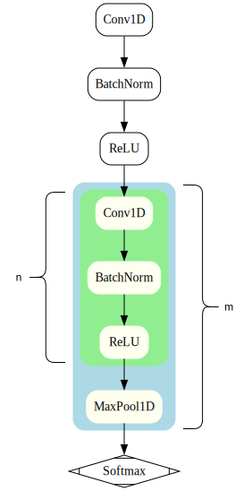

# Installation
## Linux & OSX
```sh
git clone https://github.com/Emirhankayar/MATECG-UI.git
cd MATECG-UI

# Use python 3.11
python3.11 -m venv venv
source venv/bin/activate

chmod +x install.sh
./install.sh
```
## Windows
```sh
git clone https://github.com/Emirhankayar/MATECG-UI.git
cd MATECG-UI

python3.11 -m venv venv

.\venv\Scripts\Activate.ps1

pip install tensorflow
pip install signal-grad-cam
pip install openpyxl
pip install pandas
pip install PyQt5
pip install pyqtgraph
pip install pyqt-svg-button
pip install absresgetter
pip install scikit-learn
pip install matplotlib

mkdir src\Data -Force
cd src\Data

pip install gdown

gdown https://drive.google.com/uc?id=14wejH07V4TiktA6WkpqACbwng66IVcgt
gdown https://drive.google.com/uc?id=1h8L52fI3sTAhSSUkBu0Ku5VdsEwPhIYS

Get-ChildItem -Filter *.zip | ForEach-Object { Expand-Archive -Path $_.FullName -DestinationPath "." }

cd ../..
python3 main.py

```
# ECG Classification Based Medical Device Prototype
This is the repository for the Medical Device Software Prototype being devoleped by Alessandro Longato, Emirhan Kayar, Lodovico Cabrini, and Libero Biagi, for the Laboratory of Medical Devices and Systems, third year of the Bachelor of Science in Artificial Intelligence (a.y. 2024/2025).

## Our Idea
Our idea is to develop a machine learning software able to detect diffrent kinds of arrhythmia starting from raw ECG data and basic patient information, like age and gender. To complete the medical device, this software should be embedded in a portable ECG scanner, but this is beyond the scope of the laboratory. However, this project still delivers an industrial level application, and the model training software.

## Data
Two distinct datasets are used to evaluate the model's generalization capability. The internal dataset, used for training and internal-testing, is sourced from this paper: [A 12-lead electrocardiogram database for arrhythmia research covering more than 10,000 patients](https://www.nature.com/articles/s41597-020-0386-x). The external dataset (link to be added) is used only for independent validation.

## Preprocessing
Preprocessing involves denoising the signals, time-binning them to a fixed length of 500, casting arrays to float32 and labels to int32, organizing directories, applying min-max scaling, and mapping the labels.

## Model Architecture  
<p align="center">
  
</p>

## Final Pipeline
--TO BE ADDED--
- Preparing the Application (plugging the data, model)


